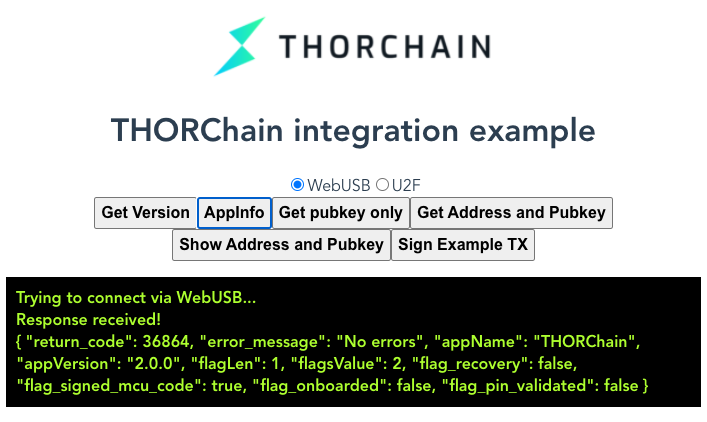

# ledger-thorchain-js

[](https://opensource.org/licenses/Apache-2.0)

This package provides a basic client library to communicate with a THORChain App running in a Ledger Nano S/X

We recommend using the [npm package](https://www.npmjs.com/package/@thorchain/ledger-thorchain) in order to receive updates/fixes.

## Build

```bash
yarn build
```

## Tests

### Unit tests

```bash
yarn test:unit
```

### e2e tests

`e2e' tests are to run some tests against your connected Ledger locally (no CI).

Create a `.e2e.env` (use `.e2e.env.sample` as template) to add `THOR_PUB_KEY` (public key of your Ledger) and `THOR_ADDRESS` (`thor` address of your Ledger).

Connect your Ledger, open `THORChain` app on it and start e2e tests locally:

```bash
yarn test:e2e
```

Hint: Add [`.only`](https://jestjs.io/docs/api#testonlyname-fn-timeout) to the tests to run a single test only


## Example

This repo also includes a simple Vue example for U2F and WebUSB.

To run it locally

```bash
yarn serve
```
and open Chrome at https://localhost:8080/


